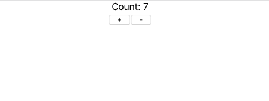

# Introduction to React

This repository contains the code of the apps made during the **React** lecture. (To change branch you can click on the **Branch** dropdown in the top left corner of thhe github repository).

## Apps and branches
- master -> Todo App
- counter-app -> Counter App
- routes -> Blog App using Routers

To run both apps you have common instructions.
- Install the dependencies `yarn install` or `npm install`.  Whatever package manager you have installed.
- Start the server `yarn start` or `npm start`.
- Goto to `localhost:3000`. You can see the app up and running. 
### Screenshots 

#### Todo App

#### Counter App

### Note:
- If you are facing any difficulty you can raise an issue or message me personally.
- Also, make sure that you are using the latest stable version of node (Prefer 12.14.1)

